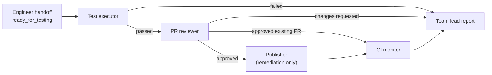

# Proposed remaining workflow



## 1. Test executor — next to build

**Purpose**: validate the actual PR or engineer-produced changes deterministically.

**Inputs**:

- `latest-engineer-execution.json`
- `repo-info.yml` quality gates
- Architect decision / acceptance criteria
- Existing PR URL, or the engineer-created local branch

**Behavior**:

- Creates a disposable Git worktree under `/projects/.repo-agent-worktrees/<repo>/<run-id>`.
- For an existing PR, fetches/checks out that PR’s head in the disposable worktree.
- For remediation work, checks out the engineer branch.
Runs only configured gates: bootstrap, format, lint, tests, coverage, security.
- Captures exit codes, concise output, parsed coverage, and failures.
- Always removes the disposable worktree.
- Does not modify the configured repository checkout, commit, push, create PRs, merge, or dismiss alerts.

**Outputs**:

-`test-report.json`
-`test-report.md`
-**Status**: passed, failed, or blocked

This should be a deterministic executor, not an LLM agent. It can still have a mounted test_agent.md that documents its role and policy.

## 2. PR reviewer

**Purpose**: independently assess the actual diff against the `architect-approved` acceptance criteria and test report.

**Inputs**:

- Architect plan and critic decision
- Engineer execution report

**Test report**

- Actual Git diff / existing PR diff

**Behavior**:

- LLM-based, using `qwen3-coder:30b`.
- Produces a structured review: findings, severity, required changes, approval decision.
- Does not modify code or interact with GitHub.
- For an existing Dependabot PR, reviews that PR’s real diff.
- For engineer-generated remediation, reviews the local branch diff before publishing.

**Outputs**:

- `pr-review.json`
- `pr-review.md`
- **Status**: approved, changes_requested, or blocked

## 3. Publisher — only for newly implemented remediation

Existing GitHub PRs do not need this stage.

**Purpose:** publish a reviewed, passing local remediation branch.

**Inputs**:

- Passed test report
- Approved PR review
- Engineer branch name

**Behavior**:

- Re-checks the branch is clean except for expected implementation changes.
- Commits a bounded generated message.
- Pushes the branch.
- Opens a draft PR.
- Records PR URL and head SHA.

**Authority**:

- Needs a dedicated write token with repository Contents read/write 
and Pull requests read/write.
- Never merges or closes PRs.

**Outputs**:

- `publication-report.json`
- Status: draft_pr_opened or blocked

## 4. CI monitor

**Purpose**: monitor GitHub checks after an existing or newly published PR is ready.

**Inputs**:

- PR URL / number
- Expected head SHA

**Behavior**:

- Polls GitHub Actions and CodeQL at a bounded interval.
- Treats changed head SHAs as stale and restarts the observation window.
- Reports every required check as passed, failed, pending, or unavailable.
- Does not merge.

**Outputs**:

- `ci-monitor-report.json`
- **Status**: passed, failed, pending, or blocked

## 5. Team-lead final report

The team lead becomes a consolidator, not a long-running worker.
It reads all stage reports and produces:

- Current item state
- Links to PRs and reports
- Failed gates or requested changes
- Explicit next owner/stage
- Whether human approval is required

### Subagent breakdown

Use one Codex subagent per implementation task, sequentially:

1. `test_executor` — implement disposable-worktree testing and reports.
2. `test_agent_prompt` — define/test mounted test_agent.md frontmatter and policy.
3. `pr_reviewer_executor` — implement local/existing-PR diff review handoff.
publisher_executor — implement the write-enabled publish-only service.
4. `ci_monitor_executor` — implement bounded GitHub-check monitoring.
workflow_integration — connect state transitions to the team-lead report.
5. `security_reviewer` — independently review each write-capable executor before its PR is opened.

Each subagent should return only: changed files, tests run, evidence, and its recommended next handoff.

### Docker context

Your dockun=docker --context unraid alias is useful: bind-mount paths in Compose will be resolved on Unraid, which is exactly what you want.

```bash
dockun ps
dockun compose -f /Users/aaron/unraid/projects/repo-agent/compose.yml config
dockun compose -f /Users/aaron/unraid/projects/repo-agent/compose.yml up -d
```

One caveat: shell aliases often are not available to non-interactive tools or subagents. I recommend also creating an executable wrapper named dockun somewhere on your PATH, containing:

```sh
#!/usr/bin/env sh
exec docker --context unraid "$@"
```

That gives the same command consistently from Terminal, scripts, Makefiles, and agent executors.
The next concrete implementation should be the deterministic test executor.

> once the plan has been created, assign the 1st item to the senior_software_engineer role to implement

> Yes — after architect + critic approval, the team lead should automatically select and assign only the first actionable item to senior_software_engineer.
The revised flow is:

```text
approved architect plan
  → approved critic decision
  → team lead selects first eligible item
  → engineer handoff / preflight / execution
  → test agent
  → PR review
  → publish or CI monitoring
  → team lead selects the next item
```

The first implementation task should therefore be the team-lead dispatcher, before the test executor.
It should:

- Read the approved architect plan and critic result.
- Select the first item with an Approve disposition, in plan order.
- Skip items already completed, active, blocked, or already associated with an open PR workflow.
- Write active-work-item.json with the exact item ID, repository, plan/critic references, and stage engineer_handoff.
- Invoke the senior-engineer handoff for that one item only.
- Never start multiple engineering jobs at once.
- On each later daemon cycle, advance the active item if its stage report is complete; only select the next approved item after the prior one reaches a terminal state.

For your current PR workflow, an existing Dependabot PR selected by the dispatcher would follow:

```text
team lead → engineer handoff → existing_pr_ready_for_testing
→ test agent → PR reviewer → CI monitor → team lead
A new remediation item would instead follow:
team lead → engineer handoff → engineer executes patches
→ test agent → PR reviewer → publisher opens draft PR
→ CI monitor → team lead
```

This gives you serialized, resumable work across every repo and prevents several large Ollama jobs or write-capable engineering containers from running concurrently.
